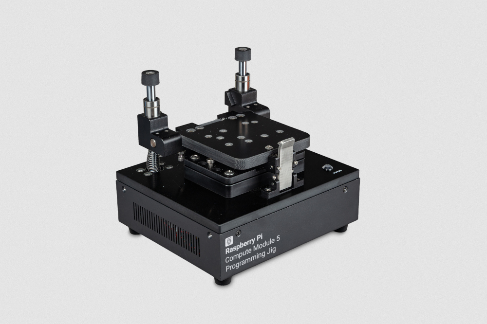
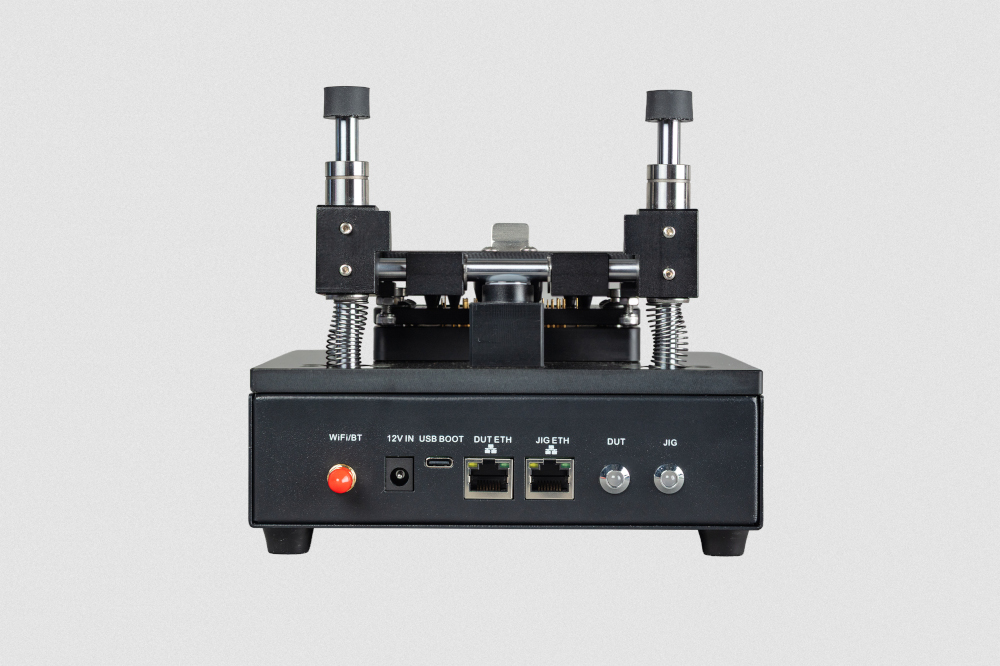
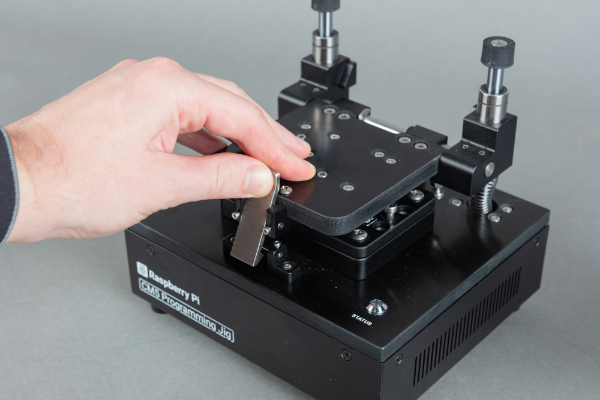
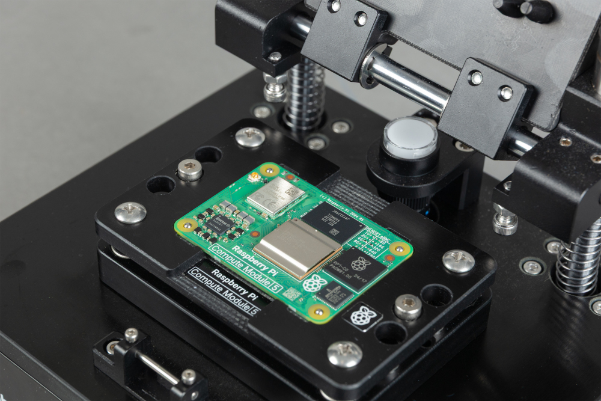

The https://www.raspberrypi.com/products/cm5-programming-jig[Compute Module 5 Programming Jig] is a provisioning system that programs one Compute Module 5 (CM5) at a time with an operating system (OS) and security configuration. The jig connects directly with each CM5, eliminating the need for a separate IO board during provisioning.

The jig runs https://github.com/raspberrypi/rpi-sb-provisioner[`rpi-sb-provisioner`] to automate the provisioning workflow. When you insert and secure a CM5 into the jig, the jig automatically performs all configuration steps, including secure boot configuration, full-disk encryption, and operating system installation.

.The Compute Module 5 Programming Jig

== Specifications

This section describes the physical characteristics and capabilities of the Compute Module 5 Programming Jig, including specifications, features, and hardware.

.General specifications
[cols="1,2", options="header"]
|===
| Specification
| Description

| Compatible devices
| Raspberry Pi Compute Module 5 (CM5)

| Provisioning capacity
| Single-device provisioning; the jig configures one CM5 at a time

| Jig network interface (*JIG ETH*)
| Ethernet (10/100/1000) or Wi-Fi (2.4 GHz and 5.0 GHz IEEE 802.11 b/g/n/ac).

| CM5 network interface (*DUT ETH*)
| Ethernet (10/100/1000)

| Dimensions (including antenna)
| 170 × 181.4 × 153.3 mm

| Weight
| 1800 g

|===

=== Features

* *Mechanical clamping.* The jig secures the CM5 in place during programming.
* *Carrier board-free provisioning.* The jig uses spring-loaded pogo pins to interface directly with a CM5, eliminating the need for a carrier (IO) board and reducing wear on the high-density pin connectors.
* *LED status indicators.* The jig displays its current state and provisioning progress through dedicated LEDs. For more information about these LEDs, see <<led-indicators, LED indicators>>
* *Dual network connectivity.* The jig connects to the provisioning network by Ethernet (*JIG ETH*) or Wi-Fi®, with a second Ethernet port (*DUT ETH*) providing accelerated software transfer to the CM5 being programmed.
* *Automated provisioning.* The jig automates the provisioning workflow, including OS installation, full-disk encryption, and secure boot configuration (depending on the security mode you choose).
* *Three security modes.* You have the option to configure the jig to program a CM5 with one of three security modes: full security (`secure-boot`), encrypted storage and device-unique keys (`fde-only`), and OS-only (`naked`). For more information, see <<security-modes>>.

WARNING: Don't touch the pogo pins because they're sharp and can carry charge; you might damage the pins, the jig, or yourself.

=== Hardware

The Compute Module 5 Programming Jig box contains the following parts:

* A Compute Module 5 Programming Jig.
* A global power supply with 110 V to 240 V AC input and 12 V DC, 2 A (24 W) output.
* A Wi-Fi antenna.

During usage, you interact with the Compute Module 5 Programming Jig connectors and module bay. There's also a safety button that you don't interact with directly.

==== Connectors

.The connectors on the back of the CM5 Programming Jig

The back of the Compute Module 5 Programming Jig provides four external connectors:

.External connectors on the back of the Compute Module 5 Programming Jig
[cols="1,2", options="header"]
|===
| Label
| Description

| *12 V IN*
| A barrel power jack that accepts 12 V DC, 2 A (24 W) DC input from the supplied power supply.

| *USB BOOT*
| A USB-C port used to connect your jig to a computer when using Raspberry Pi Imager to write the jig's operating system (see <<setup-step-write-os>>).

| *JIG ETH*
| An RJ45 Ethernet port for connecting the jig to the provisioning network for configuration, management, and software updates.

| *DUT ETH*
| An RJ45 Ethernet port for connecting an inserted CM5 to the provisioning network for accelerated data transfer during provisioning.
|===

As an alternative to the *JIG ETH* port, you can connect the jig to the provisioning network wirelessly using Wi-Fi.

==== Module bay

The module bay on top of the Compute Module 5 Programming Jig holds the CM5 that's being programmed.

The CM5 fits snugly within the module bay with the Raspberry Pi logo on the CM5 facing up and in the same orientation as the Raspberry Pi logo on the jig. The metal latch at the front of the module bay holds it closed.

==== Safety button

An unmarked safety button is located on top of the jig, at the back of the module bay. The provisioning software uses this button to detect when the jig is closed.

WARNING: Don't manually press this button because doing so can interrupt a provisioning operation.

[[security-modes]]
==== Security modes

The jig supports three security modes:

// Change to link to security section when available.

.Security modes
[cols="1,3", options="header"]
|===
| Mode
| Description

| `secure-boot`
| Full security: secure boot, encrypted storage, and device-unique keys. Use for production devices that need maximum security.

| `fde-only`
| Encrypted storage and device-unique keys without secure boot. Use when you need encryption but not secure boot restrictions.

| `naked`
| Just the operating system without encryption or secure boot. Use for development devices or when security is not required.
|===

[[set-up-the-jig]]
== Set up the jig

To set up the jig for the first time, you need the following:

* A Raspberry Pi Compute Module 5 Programming Jig.
* The supplied 12 V, 2 A (24 W) power supply.
* A USB-C cable.
* A computer with https://www.raspberrypi.com/software/[Raspberry Pi Imager] version 2.0.11 or later installed on it.
* Access to the https://downloads.raspberrypi.com/cm5-jig/cm5-jig.rpi-imager-manifest[Raspberry Pi Compute Module 5 Programming Jig manifest].
* Access to the provisioning network (Ethernet or Wi-Fi).

[[setup-step-configure-imager]]
=== Step 1: Configure Raspberry Pi Imager

You must first configure Raspberry Pi Imager to use the Compute Module 5 Programming Jig manifest and enable `rpiboot` support. If you're using Raspberry Pi Imager to install multiple jigs, you need to do the configuration in this step only once; Imager saves these settings for subsequent writes.

==== Configure the manifest

You can configure the Compute Module 5 Programming Jig manifest automatically or manually.

[tabs]
======
Automatic configuration::
+
To open Raspberry Pi Imager with the custom repository configured, enter the following URL into your web browser: `rpi-imager://open?repo=https://downloads.raspberrypi.com/cm5-jig/cm5-jig.rpi-imager-manifest`.

Manual configuration::
+
To configure the repository manually, open Raspberry Pi Imager and complete the following steps:
+
. Select *App Options* from the bottom left.
. Next to *Content Repository*, select *Edit*. The *Content Repository* window opens.
. Select *Use custom URL*.
. In the displayed field, enter the manifest URL (`https://downloads.raspberrypi.com/cm5-jig/cm5-jig.rpi-imager-manifest`).
. Select *Apply & Restart*.
======

==== Enable `rpiboot` support

To configure Raspberry Pi Imager to support `rpiboot`, complete the following steps:

. Open *Debug Options*:
** On Windows or Linux, type *Ctrl + Alt + S*.
** On macOS, type *Cmd + Option + S*.
. Scroll to *Advanced Features*.
. Use the toggle to select *Enable Rpiboot/Fastboot support*.
. Select *Apply* to save your changes and exit the *Debug Options* dialog.

[[setup-step-write-os]]
=== Step 2: Write the operating system to the jig

With Imager configured to use the custom content repository, you can now write the OS to the jig.

. Connect the USB-C cable from your computer to the jig's *USB BOOT* port.

. Connect power to the jig.
+
The jig boots into USB mass-storage mode. Your computer detects the jig's internal storage as a removable drive.

. Open Raspberry Pi Imager on your computer.

. On the *Device* tab, select *Raspberry Pi Compute Module 5 Programming Jig*. Select *Next*.

. On the *OS* tab, select *Compute Module 5 Programming Jig OS* as the operating system image. Select *Next*.

. On the *Storage* tab, select the jig's internal storage as the target. This is listed as *Raspberry Pi Compute Module 5 Lite*. Select *Next*.

. On the *Customisation* tabs that follow, configure the operating system:
+
.. Set a hostname for the jig.
.. Select your capital city to set the localisation settings.
.. When creating a username, you must specify the username *jig*. You can set a password of your choice for this account.
.. Optional: If you plan to connect the jig by Wi-Fi, configure your wireless network credentials.
.. Optional: Enable SSH for remote access.
.. Associate the jig with your Raspberry Pi Connect account for remote management.

. On the *Writing* tab, check your settings and, if these are correct, select *Write*.

. After Raspberry Pi Imager has finished writing, disconnect the USB-C cable and power cycle the jig by removing and reinserting the power cable.

[[setup-step-connect-network]]
=== Step 3: Connect to the provisioning network

Connect the jig to your provisioning network using one of the following methods:

* (Recommended) <<setup-step-ethernet, Ethernet>>
* <<setup-step-wifi, Wi-Fi>>

The jig uses the connection to the provisioning network to:

* Provide Raspberry Pi Connect screen sharing and SSH access.
* Download software updates.
* Transfer OS images to the jig.

WARNING: The provisioning network always has direct access to the jig. If you also connect the *DUT ETH* port to the provisioning network (see <<setup-step-connect-dut>>), the network has direct access to devices during programming. Consider the design of this network as part of your threat model. Ensure that only authorised systems and personnel have access to the provisioning network.

[[setup-step-ethernet]]
==== Connect using Ethernet (recommended)

To connect the jig to your provisioning network over Ethernet:

. Ensure the jig is powered off by unplugging the power cable.
. Connect an Ethernet cable from your provisioning network to the jig's *JIG ETH* port.
. Power on the jig by plugging in the power cable.

The jig obtains a network address automatically using DHCP.

[[setup-step-wifi]]
==== Connect using Wi-Fi

If you configured Wi-Fi credentials in Raspberry Pi Imager, the jig connects to your wireless network automatically on boot.

. Ensure the jig is powered off by unplugging the power cable.
. If your jig has an Ethernet cable connected to the *JIG ETH* port, disconnect this cable from the jig.
. Power on the jig by plugging in the power cable.

The jig connects to the configured wireless network.

[[setup-step-connect-dut]]
=== Step 4: Connect the DUT ETH port (optional)

For accelerated data transfer during provisioning, connect an Ethernet cable from the provisioning network to the jig's *DUT ETH* port. This provides a direct Ethernet interface to the CM5 being programmed.

[[setup-step-use-provisioner]]
=== Step 5: Access the Secure Boot Provisioner web interface

The Secure Boot Provisioner (`rpi-sb-provisioner`) web interface is only available on http://localhost:3142[`localhost`]. This is a security measure that enforces authentication against the jig. To access the web interface, use Raspberry Pi Connect screen sharing to access the jig's desktop remotely.

. Sign in to https://connect.raspberrypi.com[Raspberry Pi Connect].
. Select your jig from the device list.
. Start a screen sharing session by selecting the *Connect* button and choosing *Screen Sharing*.

If the Secure Boot Provisioner web interface isn't already open on the jig's desktop, open Chromium on the jig's desktop and go to http://localhost:3142.

[[setup-step-wormhole]]
=== Step 6: Transfer the client OS image to the jig

Before you can configure provisioning, you must transfer the OS image that you want to install on your CM5 devices to the jig.

The image must be an uncompressed `.img` file created with https://github.com/raspberrypi/rpi-image-gen[`rpi-image-gen`].

We recommend using Magic-Wormhole to transfer the image from your computer to the jig. `magic-wormhole` provides a secure, one-time file transfer between two computers. To use this method, both computers must have access to the internet.

. On your computer, install `magic-wormhole`. For more information, see https://magic-wormhole.readthedocs.io/en/latest/[Magic-Wormhole].
. On your computer, use the following command to send the image file:
+
[source,bash]
----
wormhole send <path-to-image-file>
----
+
`magic-wormhole` displays a receive code. Note this code for use on the jig.

. Connect to the jig over SSH, or use a terminal in the Raspberry Pi Connect screen sharing session.
. On the jig, use the following command to install `magic-wormhole`:
+
[source,bash]
----
sudo apt install -y magic-wormhole
----
+
. On the jig, use the following command to receive the image file, replacing `<code>` with the receive code you obtained when you sent the image file from your computer:
+
[source,bash]
----
wormhole receive <code>
----

[[setup-step-configure-provisioner]]
=== Step 7: Configure the Secure Boot Provisioner

. Open the Secure Boot Provisioner web interface as described in <<setup-step-use-provisioner>>.
. On the *Options* tab, configure the following options:
.. In the *OS Image* section, select *Upload New Image* and select or browse to the operating system image that you transferred to the jig.
.. In the *Device & Firmware* section, for *Device family*, choose *Raspberry Pi 5*.
.. In the *Device & Firmware* section, for *Storage Type*, choose *eMMC*.
.. In the *Security Configuration* section, for *Provisioning Style* choose the security mode. For more information, see <<security-modes>>.
.. Signing key: For `secure-boot` mode, provide a signing key. The web interface guides you through creating one.

// ^ Does it? When?

For more information about configuration options, see the https://github.com/raspberrypi/rpi-sb-provisioner/blob/main/docs/config_vars.adoc[Secure Boot Provisioner configuration reference].

[[program-cm5]]
== Program a Compute Module 5

Use the Compute Module 5 Programming Jig to provision a Compute Module 5 (CM5) with an operating system image.

Before you begin, ensure that the jig is:

* Powered on, with the *JIG* and *STATUS* LEDs showing green.
* Connected to the provisioning network. For more information, see <<setup-step-connect-network>> in the *Set up the jig* instructions.
* Configured with an operating system image and provisioning options. For more information, see <<setup-step-configure-provisioner>> in the *Set up the jig* instructions.

[[program-step-load]]
=== Step 1: Insert the CM5 into the jig

. Press the top of the latch backwards to release the clamping mechanism, allow the lid to slide up, and then pivot the lid back until it stops.
+

. Place the Compute Module 5 into the module bay with the Raspberry Pi logo on the CM5 facing up and in the same orientation as the Raspberry Pi logo on the jig. Align the holes on the corners of the Compute Module 5 with the through-hole studs on the corners of the module recess. The studs thread through the holes on the CM5.
+

. Close the clamping mechanism by pivoting the lid forwards until it is parallel with the CM5 and pressing the lid so it slides down. When it reaches the bottom, the latch engages and secures the CM5 in place.

WARNING: Ensure that the through-hole studs pass through all four corner holes on the CM5 before closing the lid. Incorrect alignment can result in a failed provisioning attempt or damage to the pogo pins.

[[program-step-monitor]]
=== Step 2: Monitor provisioning progress

After the CM5 is clamped in place, the jig begins provisioning automatically.

Typical provisioning time is approximately 1.5 minutes for each CM5 with a 2.6 GB OS image installed using the `naked` provisioning style. Actual time varies depending on OS image size, storage type, security mode, and network speed.

WARNING: Don't remove the CM5 from the jig while provisioning is in progress. Don't press the unmarked button on the jig. Either of these actions can render the CM5 unusable.

Monitor the *STATUS* LED on the jig to track progress through the provisioning phases:

.Status indications during provisioning
[cols="1,1,2", options="header"]
|===
| Status LED
| Phase
| Description

| Flashing blue
| Provisioning
| The jig detects the CM5 and loads a temporary Linux environment. In `secure-boot` mode, the signing key hash is programmed into the device OTP memory (this is a permanent operation).

The jig selects the appropriate provisioning service based on the security mode you chose in <<setup-step-configure-provisioner>>.

The jig creates encryption keys (if applicable), formats storage, and installs the operating system.

| Green
| Success
| Provisioning is complete. The CM5 can be removed.

| Flashing red
| Provisioning failed
| The provisioning process failed. For more information, see <<troubleshooting>>.

|===

For more detailed progress information, you can also use the Secure Boot Provisioner web interface. Access http://localhost:3142 as described in <<setup-step-use-provisioner>>, then:

. Select the *Devices* tab to see provisioning progress.
. Select a device to view detailed logs about it.

=== Step 3: Remove the CM5

When the *STATUS* LED turns green, provisioning is complete. You can remove the CM5.

. Open the clamping mechanism. Press the top of the latch backwards to release it, allow the lid to slide up, and then pivot the lid back until it stops.
. Remove the CM5 from the module bay.

The CM5 is now ready for deployment.

== View the manufacturing database

If you enabled the manufacturing database in the Secure Boot Provisioner, the jig records details about each provisioned CM5 in this database, including:

* Serial number
* Board type and revision
* MAC address (Ethernet)
* Provisioning date and time
* Installed OS image
* Security settings

You can view the information in the database through the Secure Boot Provisioner web interface or by using the command line.

Connect to the jig through Raspberry Pi Connect and export the database as a CSV file:

[tabs]
======
Using the web interface::
To export the manufacturing database to a CSV file from the web interface:
+
. Access http://localhost:3142 on the jig as described in <<setup-step-use-provisioner>>.
. Go to the *Manufacturing Database* tab.
. Select *Export as CSV* to download a spreadsheet file.

Using the command line::
Export the manufacturing database to a CSV file by running the following command:
+
[source,bash]
----
sqlite3 ${RPI_SB_PROVISIONER_MANUFACTURING_DB} \
  -cmd ".headers on" \
  -cmd ".mode csv" \
  -cmd ".output devices.csv" \
  "SELECT * FROM rpi_sb_provisioner;"
----
======

== Update the jig

To get the latest security features, we recommend that you keep your jig software up to date.

To update the jig's operating system and all installed software, including Secure Boot Provisioner, connect to the jig over SSH or use a terminal in the Raspberry Pi Connect screen sharing session and then run:

[source,bash]
----
sudo apt update && sudo apt full-upgrade -y
----

== Troubleshooting

If you experience issues with the Compute Module 5 Programming Jig and solutions in the <<common-problems>> section don't identify or resolve the problem, use the following information to diagnose the issue.

[[led-indicators]]
=== Check LED indicators

The jig uses LED indicators to communicate its current state. The following table describes each LED and its meaning.

There are two LED indicators on the back of the jig, *JIG* and *DUT*, and one LED on the top, *STATUS*.

.LED indicators on the Compute Module 5 Programming Jig
[cols="1,1,4", options="header"]
|===
| LED
| State
| Meaning

| JIG
| Off
| The jig isn't powered. Plug in the power cable to bring the jig online.

| JIG
| Solid green
| The jig is powered on.

| JIG
| Flashing green
| The jig is active; data transfer is in progress.

| JIG
| Solid red
| The jig powered on but the CPU isn't running.

| DUT
| Off
| The jig isn't powered or no CM5 is inserted.

| DUT
| Solid green
| The CM5 is detected and powered.

| DUT
| Flashing green
| The CM5 is active; data transfer is in progress.

| DUT
| Solid red
| This can indicate that the CM5 is damaged. If this light remains red with multiple different modules, it might indicate a problem with the jig. For more information, see <<get-help>>.

| STATUS
| Off
| The jig is powered off. Plug in the power cable to bring the jig online.

| STATUS
| Solid red
| The jig is powered, but not yet ready to provision a CM5.

| STATUS
| Flashing blue
| Provisioning in progress. Don't remove the CM5 during this phase.

| STATUS
| Solid green
| If there isn't a CM5 in the jig, the jig is ready to begin provisioning.

If there is a CM5 in the jig, provisioning completed successfully and the CM5 can be removed.

| STATUS
| Flashing red
| Provisioning failed.
|===

[[check-the-logs]]
=== Check the logs

If a provisioning attempt fails, you can check the logs for error details.

[tabs]
======
Using the web interface::
+
. Access http://localhost:3142 on the jig as described in <<setup-step-use-provisioner>>.
. Select the *Services* tab.
. Find your CM5 in the *System Services* table.
. Select *View logs* to view detailed logs about it.

Using the command line::
+
To view logs for a specific device, connect to the jig over SSH or through Raspberry Pi Connect.
+
Run the following command, replacing `<serial>` with the device serial number:
+
[source,bash]
----
tail -f /var/log/rpi-sb-provisioner/<serial>/provisioner.log
----
+
For more detailed logs, run the following command, replacing `<serial>` with the device serial number:
+
[source,bash]
----
journalctl -xeu rpi-sb-provisioner@<serial> -f
----
======

[[clear-the-cache]]
=== Clear the cache

If old files cause problems, you can clear the provisioning cache. Clearing the provisioning cache causes the next provisioning operation to take longer.

. Access http://localhost:3142 on the jig as described in <<setup-step-use-provisioner>>.
. Go to the *Options* tab and the *OS Image* section.
. Select the OS image that you want to clear from the provisioning cache.
. Select *Clear cached files*.
. On the confirmation window, select *OK* to confirm the action.

[[common-problems]]
=== Common problems

This section describes common problems that you might encounter when using the Compute Module 5 Programming Jig and suggests ways to resolve them.

==== Device not detected

If the CM5 is clamped in the jig, but provisioning doesn't start, try the following:

. Ensure that the jig is powered on and connected to the network.
.. If the *JIG* LED indicator isn't lit, ensure that the power cable is plugged in.
.. Verify the network by connecting to the jig from another computer.

. Ensure that the CM5 is correctly seated and aligned with the pogo pins.
.. Open the clamp.
.. Reposition the CM5, ensuring that the Raspberry Pi logo is facing up and in the same orientation as the logo on the jig, and that the through-hole studs on the jig pass through all four corner holes on the CM5.
.. Ensure that the Compute Module is well-seated into the module bay recess and has no play in any horizontal direction.
.. Close the clamp again.

. Check whether the pogo pins are dirty or damaged.
.. Inspect the pogo pins for debris or damage.
.. If the pogo pins are dirty, gently clean them with a cotton swab dipped in isopropyl alcohol or a specialist cleaning fluid.

==== Provisioning stops or never completes

If provisioning starts but never finishes, try the following:

. Check the logs for error messages (see <<check-the-logs>>).
. Clear the cache (see <<clear-the-cache>>).
. Check that the jig has at least 32 GB of free storage space.
. Try provisioning a different CM5 to determine whether the problem is device-specific.

==== Error: "Already signed"

If the error logs report that the CM5 is already signed or secure, the CM5 was previously programmed with a signing key. This operation is permanent and can't be reversed. However, the following actions are available for this CM5:

* To skip the signing step, set the *Skip EEPROM Update* flag for this device.
.. Access http://localhost:3142 on the jig as described in <<setup-step-use-provisioner>>.
.. Go to the *Devices* tab and select the device you're programming.
.. On the device-specific page, in the *Special Flags* section, set *Skip EEPROM Update* to *One-time*.

* To use the same key to completely re-provision the device, set the *Re-provision Device* flag for this device.
.. Access http://localhost:3142 on the jig as described in <<setup-step-use-provisioner>>.
.. Go to the *Devices* tab and select the device you're programming.
.. On the device-specific page, in the *Special Flags* section, set *Re-provision Device* to *One-time*.

[[get-help]]
=== Get help

If you encounter a problem that isn't covered in this section, report it at https://github.com/raspberrypi/rpi-sb-provisioner/issues[the rpi-sb-provisioner issue tracker]. Include the device type that you're trying to provision, error messages, and <<check-the-logs, log files>>.

== Safety warnings

* Disconnect the jig from the power supply before performing any maintenance.
* Don't touch the metallic pogo pins in the module bay. They are sharp and can carry charge; you might damage the pins, the jig, or yourself.
* Ensure that the CM5 is correctly seated in the module bay as described in <<program-step-load>>. Seating it incorrectly can damage the pogo pins.
* Don't remove the CM5 from the jig while the provisioning process is in progress (*STATUS* LED is flashing blue); this can render the CM5 unusable.
* Don't press the unmarked button on the jig; this can interrupt provisioning and render the CM5 unusable.
* Don't insert a Compute Module 4 into the Compute Module 5 Programming Jig.
