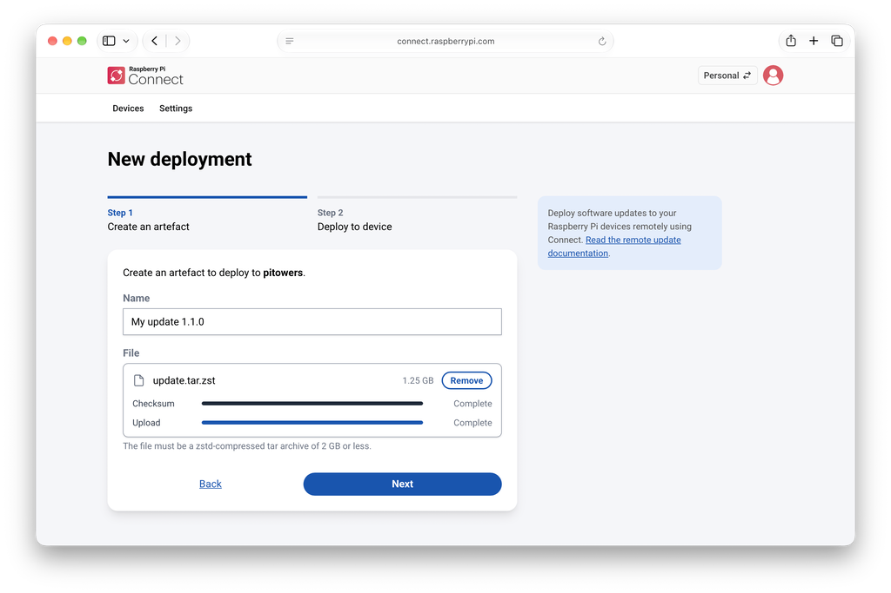
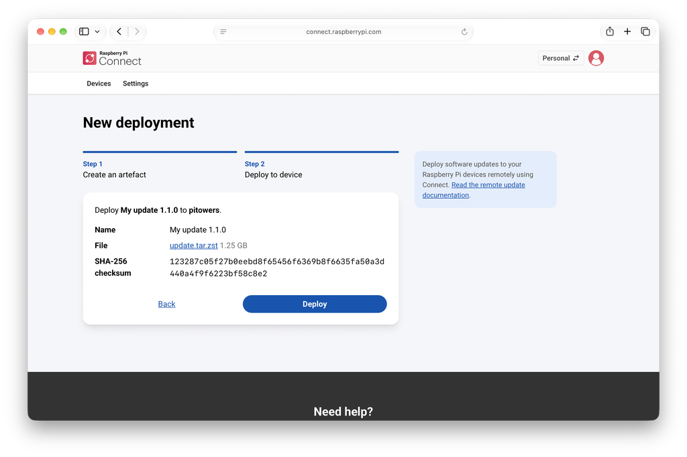

== Remotely update your devices
[[remoteupdate-intro]]
Connect includes the ability to update your Raspberry Pi devices by remotely pushing them updates.

Remote updates are useful for updating devices behind a firewall, and devices that are physically remote or hard to reach.

Connect supports two types of update artefact:

* <<remoteupdate-otamaker,Script artefacts>>, created with `otamaker`, run a shell script as root on the device. They work on a standard installation of Raspberry Pi OS and suit maintenance tasks such as upgrading packages.
* <<remoteupdate-ab,A/B boot updates>>, created with `rpi-image-gen`, replace the entire operating system and automatically revert to the previous version if the update fails. They require imaging the device with an A/B boot layout first.

Whichever type of artefact you build, you deploy it from the Raspberry Pi Connect website, as described in <<update-remotely,Deploy the update artefact>>. You upload the artefact as part of the deployment, and Connect passes it to the recipient device.

If your devices belong to a xref:../services/connect-for-organisations.adoc[Connect for Organisations] account, deployment works differently: instead of uploading the artefact, you host it yourself and give Connect its location. An organisation's devices also don't have to be online when you deploy; they're updated the next time they sign in to Raspberry Pi Connect. For more information, see xref:../services/connect-for-organisations.adoc#deploy-remote-updates[Deploy remote updates in an organisation].

[[update-remotely]]
=== Deploy the update artefact

After you've built an artefact with <<remoteupdate-otamaker,otamaker>> or <<remoteupdate-ab,rpi-image-gen>>, use the Raspberry Pi Connect website to deploy it to a device.

NOTE: If the recipient device belongs to an organisation, deploy it as described in xref:../services/connect-for-organisations.adoc#deploy-remote-updates[Deploy remote updates in an organisation] instead.

Deployments always start from the device you want to update, so make sure that the recipient device is registered to your personal account, and that it's online, before you proceed:

. Log in to Raspberry Pi Connect.
. Select the **Personal** account using the account switcher at the top right.
. Go to the **Devices** tab, then select **Deploy** next to the recipient device. **Deploy** appears only for devices that have remote update enabled and are currently online.

This opens the **New deployment** form, which creates a new artefact for the deployment in two steps.

In **Step 1: Create an artefact**, upload the artefact you built:

. Enter a **Name** for the artefact. Names don't have to be unique, so use something that helps you recognise the deployment later, such as a version number.
. Drag the artefact onto the **File** area, or select **browse** to choose it. The file must be a Zstandard-compressed tar archive (a `.tar.zst` file) of 2 GB or less.
. Wait for both **Checksum** and **Upload** to show **Complete**.
+
To choose a different file, select **Remove**. To abandon a file that is still uploading, select **Cancel**.
. Select **Next**.
+
.Step 1 of the New deployment form, showing the Name field and the uploaded artefact.

In **Step 2: Deploy to device**, check the name, file, and SHA-256 checksum, then select **Deploy**. If you spot a mistake, select **Back** to correct it.

.Step 2 of the New deployment form, showing the artefact's details for confirmation.

Connect keeps the artefact you uploaded for two hours, then deletes it. A deployment that hasn't started by the time its artefact is deleted is marked **Invalidated**. To deploy that artefact again, upload it again.

[[monitor-the-deployment]]
==== Monitor the deployment
From the **Devices** tab in Raspberry Pi Connect interface, you can select a device and then view a list of the most recent deployments uploaded to it.

Deployment states are:

* **Pending**: waiting for the recipient device to pick up the update.
* **In Progress**: the update is being applied to the device.
* **Succeeded**: the update has been applied successfully.
* **Failed**: the update failed. For more information, see <<ab-troubleshooting,Troubleshooting>>.
* **Cancelled**: the update was cancelled before it could be applied. Pending deployments are automatically cancelled when another deployment is queued for the same device.
* **Invalidated**: an update that can no longer be applied.

When a deployment is **Pending** or **In Progress**, the **Devices** page automatically updates with the current state. It stops updating once the deployment has entered **Succeeded**, **Failed**, **Cancelled**, or **Invalidated**.

To check a deployment's details:

. Log in to Raspberry Pi Connect.
. Select the **Personal** account using the account switcher at the top right.
. Go to the **Devices** tab, then select the device you deployed to. The **Deployments** section lists the most recent deployments for that device.
. Select a deployment from the list to read more about its state, or to read any error messages for a failed deployment.

To cancel a deployment:

NOTE: You can only cancel a deployment that is **Pending**.

. Log in to Raspberry Pi Connect.
. Select the **Personal** account using the account switcher at the top right.
. Go to the **Devices** tab, then select the device you deployed to. The **Deployments** section lists the most recent deployments for that device.
. From the deployment list, select the deployment you want to cancel, then select **Cancel**.

[[verify-the-deployment]]
==== Verify the deployment

To verify a deployment, see <<remoteupdate-otamaker,Script artefacts>> for a script artefact, or <<remoteupdate-ab,A/B Boot Update>> for an A/B boot update.
